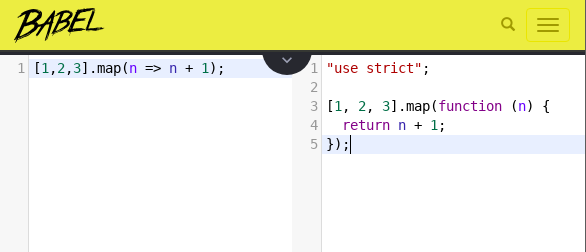

# ReactJS Essentials Training #

You'll understand the essentials of React.js and be able to start building your own browser-based projects.

- Course on [LinkedIn][1] by [Eve Porcello][2]
- Author from this repo: [Francis Rodrigues][3]

## Introduction - Some questions about React ##

### Version ##

- React 16.3.2
- ReactDOM 16.3.2
- Babel Core 5.8.38

### React Developer Tools ###

Are available for Chrome and Firebox as well.

### Where was React created ###

Facebook

### Why would you want to install the React Developer tools ###

- to see props and state information
- to understand which components are nested inside of one another
- to view all of the React elements on the page

### Updating the DOM is fast in React because ###

React makes the minimal changes to make it an update it.

## How to run this ##

You can run this project easly using a http serve you prefer or one of these that I suggest you below.

### 1. Using httpster ###

Simple http server for quick loading of content

You can install globally using npm as below:

```bash
~$ npm -g i httpster
```

Or you can use yarn if you prefer:

```bash
~$ yarn global add httpster
```

Then from any directory where you want to have an http service running, just run:

```bash
~$ httpster -p 8080 -d /home/somedir/public_html
```

### 2. Using serve ###

It provides a neat interface for listing the directory's contents and switching into sub folders.

In addition, it's also awesome when it comes to serving static sites!


Install it (needs at least Node LTS):

```bash
~$ npm -g i serve
```

or you can use yarn:

```bash
~$ yarn global add serve
```

And run this command in your terminal:

```bash
~$ serve [options] <path>
```

Run this command to see a list of all available options:

```bash
~$ serve help
```

## Using ReactJS as Pure React ##

You can start with React as simple as a JavaScript file.

```js
const { createElement } = React
const { render } = ReactDOM

const style = {
  backgroundColor: 'orange',
  color: 'white',
  fontFamily: 'verdana'
}

const title = createElement(
  'h1',
  { id: 'title', className: 'header', style: style },
  'Hello World'
)

render(
  title,
  document.getElementById('react-container')
)
```

And we just need to create our `index.html` and point the our js file to there.

```html
<!DOCTYPE html>
<html lang="en">
<head>
    <script src="https://unpkg.com/react@<VERSION>/umd/react.production.min.js"></script>
    <script src="https://unpkg.com/react-dom@<VERSION>/umd/react-dom.production.min.js"></script>
    <meta charset="UTF-8">
    <title>Hello World with React</title>
</head>
<body>
    <div id="react-container"></div>
    <script src="index.js"></script>
</body>
</html>
```

## Using ReactJS with JSX syntax ##

To create a better application you can use the JSX syntax recommended for the React doc.

```jsx
const { render } = ReactDOM

const style = {
  backgroundColor: 'orange',
  color: 'white',
  fontFamily: 'verdana'
}

render(
  <h1
    id='title'
    className='header'
    style={style}>
    Hello World
  </h1>,
  document.getElementById('react-container')
)
```

## Transpiling JavaScript using Babel ##

### What is Babel ###

Babel is a JavaScript compiler

Babel has support for the latest version of JavaScript through syntax transformers.

These plugins allow you to use new syntax, right now without waiting for browser support.



You can read more about it in [Babel oficial doc][7]

### Static transpiling with babel-cli ###

1 - Create a package.json running your favorite repo manager `npm` or `yarn` and install some dependencies as `dev` as below:

```bash
~$ yarn add -D babel-cli@6.18.0 babel-preset-latest@6.16.0 babel-preset-react@6.16.0 babel-preset-stage-0@6.16.0
```

Your code will be like this:

```json
"devDependencies": {
  "babel-cli": "6.18.0",
  "babel-preset-latest": "6.16.0",
  "babel-preset-react": "6.16.0",
  "babel-preset-stage-0": "6.16.0"
}
```

2 - Create a `.babelrc` file in root on your project and put that resources:

```json
{
  "presets": [
    "latest",
    "react",
    "stage-0"
  ]
}
```

3 - In your `index.html` file remove the babel javascript reference and make some adjustments.

The code for it follow as below:

```html
<!DOCTYPE html>
<html lang="en">
<head>
    <script src="https://unpkg.com/react@<VERSION>/umd/react.production.min.js"></script>
    <script src="https://unpkg.com/react-dom@<VERSION>/umd/react-dom.production.min.js"></script>
    <meta charset="UTF-8">
    <title>Hello World with React</title>
</head>
<body>
    <div id="react-container"></div>
    <script type="text/javascript" src="bundle.js"></script>
</body>
</html>
```

4 - Run the `babel-cli` command on console to transpille the `index.js` code

```bash
~$ babel ./src/index.js --out-file ./dist/bundle.js
```

5 - In your `package.json` file put a start command to initialize our application

```json
"scripts": {
  "start": "serve -s ./dist -p 3000"
}
```

6 - Now the project structure is a little different to be more easy to understand

```txt
my-app
├── node_modules/ (node modules folder)
├── .babelrc (babel resources)
├── .gitignore
├── package.json
├── README.md (our Doc about the project)
├── dist/
│   └── index.html
│   └── bundle.js (generated by babel-cli)
└── src/ (our source folder)
    └── index.js
```

7 - Run the start command on the console to execute our app again.

```bash
~$ serve -s ./dist -p 3000

   ┌───────────────────────────────────────────────────┐
   │                                                   │
   │   Serving!                                        │
   │                                                   │
   │   - Local:            http://localhost:3000       │
   │   - On Your Network:  http://192.168.0.104:3000   │
   │                                                   │
   │   Copied local address to clipboard!              │
   │                                                   │
   └───────────────────────────────────────────────────┘
```

## Improve building using Webpack ##

You can improve the code transpilling process with Babel using webpack.

### What is webpack ###

Webpack is used to compile JavaScript modules.

Once installed, you can interface with webpack either from its CLI or API.

### How to install webpack on my project ###

```bash
~$ yarn add webpack@1.13.3 -D
~$ yarn add babel-loader@6.2.5 -D
~$ yarn add webpack-dev-server@1.16.2 -D
```

### How to config webpack to build ###

Create a `webpack.config.js` file on the root path to our project

```js
var webpack = require('webpack')

module.exports = {
  entry: "./src/index.js",
  output: {
    path: "dist/assets",
    filename: "bundle.js",
    publicPath: "assets"
  },
  devServer: {
    inline: true,
    contentBase: "./dist/",
    port: 3000
  },
  module: {
    loaders: [
      {
        test: /\.js$/,
        exclude: /(node_modules)/,
        loader: ["babel-loader"],
        query: {
          presets: ["latest", "stage-0", "react"]
        }
      }
    ]
  }
}
```

Now our `bundle.js` is in `./dist/assets` path, so we need to change it in our `index.html` file.

Before webpack

```html
<script type="text/javascript" src="bundle.js"></script>
```

After install and configure webpack

```html
<script type="text/javascript" src="assets/bundle.js"></script>
```

### Running webpack-dev-server ###

And change our `start` command on `package.json` file to running using `webpack-dev-server`

```json
"scripts": {
  "start": "./node_modules/.bin/webpack-dev-server"
}
```

Running the `start` command we receive the webpack output as below:

```bash
$ ./node_modules/.bin/webpack-dev-server
 http://localhost:3000/
webpack result is served from /assets
content is served from ./dist/
Hash: 3ab4f982cf78411c2fb9
Version: webpack 1.13.3
Time: 857ms
    Asset    Size  Chunks             Chunk Names
bundle.js  241 kB       0  [emitted]  main
chunk    {0} bundle.js (main) 222 kB [rendered]
.....
webpack: Compiled successfully.
```

If you put a modification in your JS code, webpack will compile a new bundle and refresh the web page that is running it.

## References ##

- React Doc - [Introducint to JSX][4]
- Running with httpster - [Simple http server for quick loading of content][5]
- Running with serve - [Share a project on your network by running just a command][6]
- Babel Installation- [JavaScript compiler][7]
- Babel Core - [CDN babel-core][8]
- Webpack - [Open-source JavaScript module bundler][9]

### License ###

MIT

  [1]: https://www.linkedin.com/learning/react-js-essential-training
  [2]: https://www.linkedin.com/learning/instructors/eve-porcello
  [3]: https://github.com/francisrod01
  [4]: https://reactjs.org/docs/introducing-jsx.html
  [5]: https://www.npmjs.com/package/httpster
  [6]: https://www.npmjs.com/package/serve
  [7]: https://babeljs.io/docs/setup/#installation
  [8]: https://cdnjs.com/libraries/babel-core/5.8.38
  [9]: https://webpack.js.org/guides/getting-started/
