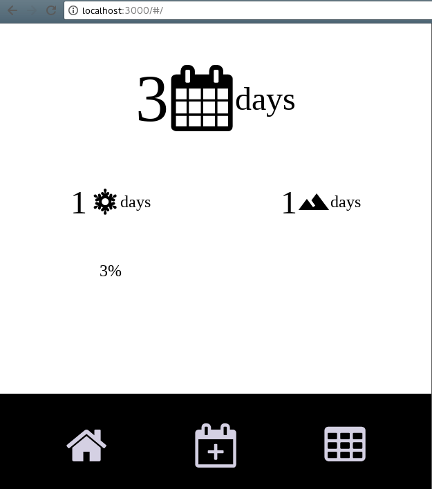

# React Components - Ski Day Count #

A project as exercise from this course.

## Version ##

- react": ^15.3.2
- react-dom": ^15.3.2
- react-icons": ^2.2.7

> Warning: Accessing `createClass` via the main React package is deprecated, and will be removed in React v16.0. Use a plain JavaScript class instead. If you're not yet ready to migrate, `create-react-class` v15.* is available on npm as a temporary, drop-in replacement.

For more info see https://fb.me/react-create-class



React removed `createClass` from version 16. You can use `create-react-class` to migrate easily as shown in react documentation.

Before (15.4 and below)

```js
var React = require('react');

var Component = React.createClass({
  mixins: [MixinA],
  render() {
    return <Child />;
  }
});
```

After (15.5)

```js
var React = require('react');
var createReactClass = require('create-react-class');

var Component = createReactClass({
  mixins: [MixinA],
  render() {
    return <Child />;
  }
});
```

## React Concepts ##

### Stateless Functional Component ###

Stateless functional components take in props and return JSX elements.

```jsx
...
render(
  <SkiDayCount
    total={50}
    powder={20}
    backcountry={10}
    goal={100}
  />
```

```jsx
export const SkiDayCount = ({ total, powder, backcountry, goal }) => (
  <div className="ski-day-count">
    <div className="total-days">
      <span>{total}</span>
      <span>days</span>
    </div>
    <div className="powder-days">
      <span>{powder}</span>
      <span>days</span>
    </div>
    <div className="backcountry-days">
      <span>{backcountry}</span>
      <span>days</span>
    </div>
    <div>
      <span>{goal}</span>
    </div>
  </div>
)
```

### React Component ###

When passing properties to a component, strings should be passed inside by `quotes`.

```jsx
...

render(
  <SkiDayCount name="MyNAME" />
)
```

```jsx
export const SkiDayCount = ({ name }) => (
  <div>
    <div>My name is:</div>
    <div>{name}</div>
  </div>
)
```
